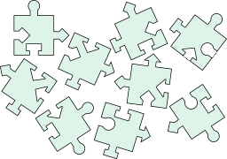
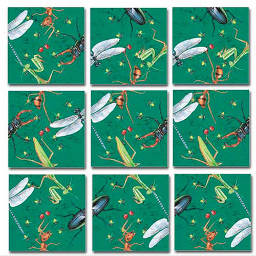

# 9piece-solver

**A Solver for 3x3 puzzles, written in C++**


_Copyright ©️ 2023 [Oliver Lau](mailto:ola@ct.de), [Heise](https://www.heise.de/) Medien GmbH & Co. KG_

---

## Intro

In puzzles like [Scramble Squares](https://www.scramblesquares.com/) or the One Tough Puzzle nine pieces have to be put together to form a 3 by 3 square. Each edge of a piece typically has one of four shapes or images. In case of shapes the positive shape fits the negative like in classical jigsaw puzzles, in case of images each image is split into two halves. Here are two examples:





Amazingly, there are about 23 billion possible arrangements: 9·8·7·6·5·4·3·2·1 = 9! to permute the positions of all pieces, times 4<sup>8</sup> for all possible orientations. Why not 4<sup>9</sup>? Because rotating the center piece will rotate the whole puzzle.

One neat algorithm to solve this kind of puzzle is described in the 2001 paper [Using backtracking to solve the Scramble Squares puzzle](doc/backtrackingPaper.pdf) by Keith Brandt et al:

- Place the first piece in the center. Its orientation doesn't matter.
- Try to place the next piece to the right of the first, the following ones in a clockwise spiral around the center, like so:
  ```
  6 → 7 → 8
  ↑
  5   0 → 1
  ↑       ↓
  4 ← 3 ← 2
  ```
- For every piece test all of the four possible orientations.
- If it fits the solver goes a level deeper and the process repeats with the remaining pieces until all pieces are placed.
- If it doesn't fit the next available piece is chosen and the process continues on the same level.

That's the algorithm this [solver](https://github.com/607011/9piece-solver/blob/main/src/solver.hpp) implements. It will find all solutions to a given puzzle. It's quite efficient: It takes only a couple of hundred tries to find a solution.

A puzzle is described in a file where each line represents one piece and the four integers in the line described the shape of an edge, e.g.

```
 -4  1  2 -2 
 -4 -4  1  3 
 -1  2  3 -2 
 -3 -1  1  3 
 -4  4  1 -3
 -3  2  3 -1 
  2 -1 -4  2 
  4  1 -2 -1 
  4 -4 -3  3 
```

To determine if two edges fit together the algorithm simple adds their values. If their sum is zero, the edges fit, otherwise they don't.

The output of the solver looks like this for every solution found:

```
--------------------------
 indexes |     turns      
---------+----------------
  1 8 6  |  2/4  1/4  1/4 
  4 7 3  |  3/4    0  2/4 
  5 0 2  |  2/4  2/4  2/4 
--------------------------
```

The left column shows the line numbers of the pieces in the original file. The right column shows how many counter-clockwise quarter turns are needed to fit the piece.


## Prerequisites

- C++11 compiler


## Build


### Linux, macOS

```
git clone https://github.com/607011/9piece-solver.git
cd 9piece-solver
mkdir build
cd build
cmake -DCMAKE_BUILD_TYPE=Release ..
cmake --build .
```

### Windows

In Visual Studio Developer Console:

```
git clone https://github.com/607011/9piece-solver.git
cd 9piece-solver
md build
cd build
cmake ..
cmake --build . --config=Release
```


## Run

```
9piece-solver data/puzzle-0000.txt
```

## License

See [LICENSE](LICENSE).

--- 

### Nutzungshinweise

Diese Software wurde zu Lehr- und Demonstrationszwecken geschaffen und ist nicht für den produktiven Einsatz vorgesehen. Heise Medien und der Autor haften daher nicht für Schäden, die aus der Nutzung der Software entstehen, und übernehmen keine Gewähr für ihre Vollständigkeit, Fehlerfreiheit und Eignung für einen bestimmten Zweck.
